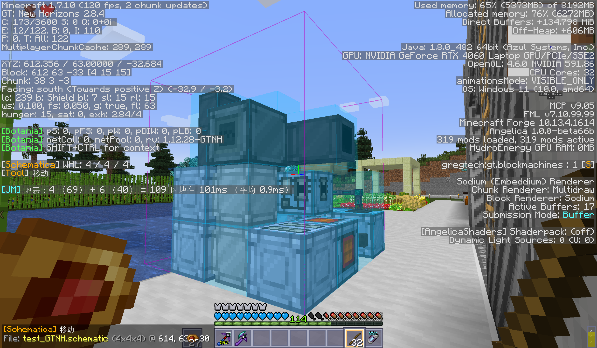

## Welcome to Schematica Plus!

### Usage:

When holding the tool item,
- Hold `LCONTROL` and scroll to swicth current tool mode.
- Use right click and left click to move, place and select.
- Use "Execute" key bind to paste, etc.

- Default tool item is `minecraft:stick`.
- Default key bind of "Save Schematic" is `N`.
- Default key bind of "Execute" (paste, etc.) is `Enter`.
- Default key bind of "Schematic Management" is `M`.

---

If you are playing on GTNH-2.8.4, you can simply replace `Schematica-1.12.6-GTNH.jar` with it.

Otherwise, you would need to also install **[LunatriusCore](https://github.com/GTNewHorizons/LunatriusCore/releases)**(>= 1.2.1-GTNH).

---

### Changes from GTNH-ver:
- Added most functions from [Litematica](https://github.com/maruohon/litematica/), made it more user-friendly.
- For example, it supports loading multiple schematic instances now.
- For example, it supports pasting schematics (including NBT tags, block states, entities, etc.) directly into the world when having permissions.
- For example, it supports storing blocks and entities with NBT tags now.
- For example, it supports different edit modes, making it a lite version of World Edit (jk)
- Supports `.litematic` (I have zero idea on why I decided to implement this, but it does work really well)
- Modern GUI from [Litematica](https://github.com/maruohon/litematica/) (Still working on this)

---

### Changes from Original:
- Store Coordinates & rotation of schematics per world/server. No more re-entering coordinates for large builds!
- Fix heavy lag when having lotr armor stands/weapon racks in loaded schematic
- Updated Chinese translation
