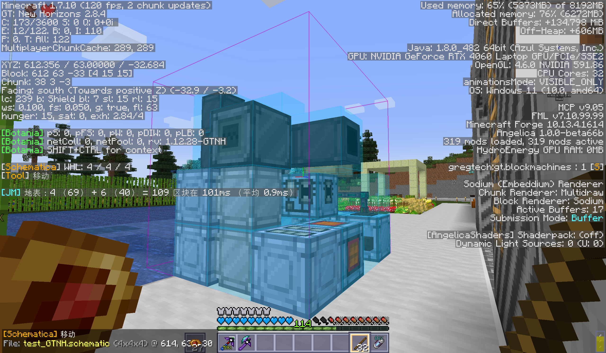

## Welcome to Schematica Plus!

### Usage:

When holding the tool item,
- Hold `LCONTROL` and scroll to switch current tool mode.
- Use right click and left click to move, place and select.
- Use "Execute" key bind to paste, etc.

Default tool item is `minecraft:stick`.

**See more detailed info on [Curseforge](https://www.curseforge.com/minecraft/mc-mods/schematica-plus) if you are new to the mod.**

### Keybinds:

| Key | Action |
|-----|--------|
| `M` | Open Schematic Management GUI |
| `N` | Open Save Schematic GUI |
| `Enter` | Execute current tool action (save, paste, fill, delete, replace) |
| `LCTRL + Scroll` | Cycle tool mode (while holding tool item) |
| Left Click | Set point A / Pick primary block (while holding tool item) |
| Right Click | Set point B / Pick secondary block / Place schematic (while holding tool item) |

---

If you are playing on GTNH-2.8.4, you can simply replace `Schematica-1.12.6-GTNH.jar` with it.

LunatriusCore is no longer required. Schematica Plus includes the utility classes it uses
under its own internal package, so an external LunatriusCore can still be installed for
other mods. See [third-party notices](THIRD_PARTY_NOTICES.md) for attribution.

For bounded memory use, schematics are limited to 16,777,216 blocks, 32,767 blocks per
axis, and 1,048,576 X/Y array rows. NBT reads have a 128 MiB allocation budget and a
maximum nesting depth of 64. World edits and captures must stay within Y=0..255.
Only one save per player and four queued saves globally are accepted at a time.

Integrated-server edits require creative mode and command permission. They run in
bounded batches on server ticks; pressing Execute again cancels the remaining work
and retains edits already made. Multiplayer command fallback is rate-limited and
reports commands sent, not server-confirmed changes. The 1.7.10 chat limit prevents
general NBT transfer: pasting schematics with block/entity NBT through that fallback
is rejected before sending commands. Disable those options for a block-only paste.

---

I'm currently working on other projects, so development is on hold for now.

If you’d like to contribute to this enhanced mod, feel free to go ahead.

### Changes from GTNH-ver:
- Added most functions from [Litematica](https://github.com/maruohon/litematica/), made it more user-friendly.

For example:
- Loading multiple schematic instances.
- Pasting schematics (including NBT tags, block states, entities, etc.) directly into the world when having permissions.
- Storing blocks and entities with NBT tags.
- Different edit modes, making it a lite version of World Edit (jk).
- Supports `.litematic` (I have zero idea on why I decided to implement this, but it does work really well).
- Modern GUI from [Litematica](https://github.com/maruohon/litematica/) (Still working on this).

---

### Changes from Original:
- Store Coordinates & rotation of schematics per world/server. No more re-entering coordinates for large builds!
- Fix heavy lag when having lotr armor stands/weapon racks in loaded schematic
- Updated Chinese translation
